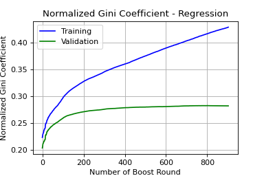
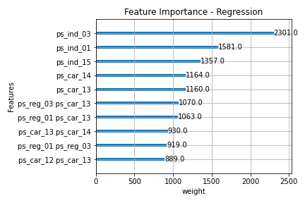
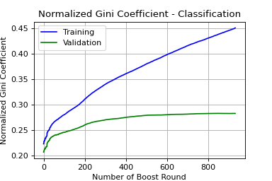
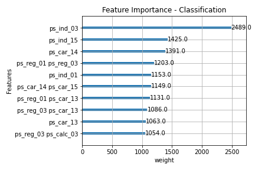

# 220417_kaggle_Practice_Porto-Seguro-s-Safe-Driver-Prediction
Porto Seguroの自動車保険請求予測コンペ練習用レポジトリ。

## Data 
| nb No. | 特徴量数 | 説明 | 参考文献 | 
| --- | --- | --- | --- |
| (RAW) | 57 | *id*, *target*（trainのみ）除き、57の特徴量。*_ind*が18、*_reg*が3、*_car*が16、*_calc*が20。 | N/A |
| nb003 | 129 | (1)目的変数の不均衡対策としてのUndersampling：*target*=0に対して1が3.64%だったものを10%になるように*target*=0のデータをランダムに抽出。 (2)欠損値補完：*_car*の特徴量を2つ除去し、残りはmeanかmodeで補完。 (3)ダミー変数作成：categorical変数をダミー化。202特徴量に増加。 (4)交互作用特徴量の作成：257特徴量に増加。 (5)Random Forest重要特徴量による特徴量選択：129特徴量に減少。 | 1) |

1. Data Preparation & Exploration, https://www.kaggle.com/code/bertcarremans/data-preparation-exploration/notebook

## Log
### 220731
- trainデータの可視化と、データ加工を実施。

#### [nb001]
- kaggleのNotebook(BERT CARREMANS氏)を参考に、1)データ読込、2)可視化、3)加工を実施。
- 3)のデータ加工は、(1)目的変数の不均衡対策としてのUndersampling、(2)欠損値補完、(3)ダミー変数作成、(4)交互作用特徴量の作成、(5)Random Forest重要特徴量による特徴量選択、を実施。
 参考: Data Preparation & Exploration, https://www.kaggle.com/code/bertcarremans/data-preparation-exploration/notebook

  
### 220807
- nb001で加工・出力したデータを解析。

#### [nb002]
- nb001で出力したデータをSVC、ランダムフォレストのグリッドサーチで解析。
- SVCは全154通りのグリッドサーチで1～2時間程度、ランダムフォレストは全8通りのグリッドサーチで1時間程度。
- 結果は、SVC：Test accuracy=0.895755、ランダムフォレスト：Test accuracy=0.899995と、わずかながらランダムフォレストに分がある。

  
### 220911
- nb003にて、nb001を、trainおよびtestデータの両方を加工できるように変更。
- kaggle_nb001にて、nb003の加工データを基にnb002のSVCで解析。

#### [nb003]
- nb001をtestデータの加工、出力にも対応するように変更した。
- idの列は番号が歯抜けになっており、Submissionの際に必要なため、testデータのidは別ファイルで保存する仕様。

#### [kaggle_nb001]
- nb002のSVC部分を使って解析。
- 結果は、Public：-0.00031、Private：-0.00730と、低い結果となった（トップランカーで0.29程度）。出力結果であるtargetを0か1で出しているが、1にどれだけ近いかの確率で出したほうが良さそう？

  
### 220919
- kaggle_nb001のsubmit結果を踏まえ、分類クラスではなく確率を出力するようにした。

#### [nb004]
- kaggle_nb001ベースで、分類クラスではなく確率を出力するように変更。

#### [kaggle_nb002]
- nb004ベースでsubmit。結果は、Public：-0.00763、Private：-0.01385と、変わらず低い結果となった。根本的にモデルの見直しが必要。

  
### 220924
- コンペの評価指標である「標準化gini係数」を評価指標として訓練するようにした。
- 解析モデルとしてXGBoostを新たに使用して解析した。

#### [nb005]
- nb004までは、訓練時の評価指標はtarget（0 or 1）に対する予測の正解率だったが、コンペの評価指標である「標準化gini係数」を評価指標として訓練するようにした。
- 解析モデルとしてXGBoostを使用。ハイパーパラメータはネットで見かけたものの受け売り。k分割交差検証も行っておらず、check用データの標準化gini係数が改善しなくなったところで終了させる仕様（Boosting115回程度で終了）。
 参考：Stratified KFold+XGBoost+EDA Tutorial(0.281), https://www.kaggle.com/code/sudosudoohio/stratified-kfold-xgboost-eda-tutorial-0-281/notebook

#### [kaggle_nb003]
- nb005の、評価指標を標準化gini係数にしたSVCモデル解析をsubmit。Public：-0.00708、Private：-0.01531となった。

#### [kaggle_nb004]
- nb005の、XGBoostモデル解析をsubmit（評価指標は標準化gini係数）。Public：0.22483、Private：0.22897となった。

  
### 221010
- nb005のXGBモデルを使った解析を調整しやすいように少し書き換えて、いろいろ試してみた。

#### [nb006]
- nb005ベースに、パラメータを調節しやすいように書き換えた。XGBoostは、回帰モデル（reg:squarederror）を使用。
- Learning Rateを0.01と小さくし、early stoppingで最大パフォーマンスを取る。標準化Gini係数はtrain：0.417、check：0.283程度。
- Scikit-Learn APIのXGBRegressorなどを使ってGridSearchCVでパラメータ最適化を図るコードを書こうとしたが、エラーが解決せず断念。評価指標にカスタム指標（標準化Gini係数）を使っていることが原因？

 

#### [nb007]
- nb005ベースに、パラメータを調節しやすいように書き換えた。XGBoostは、二値分類モデル（binary:logistic）を使用。
- Learning Rateを0.01と小さくし、early stoppingで最大パフォーマンスを取る。標準化Gini係数はtrain：0.435、check：0.283程度。

 

#### [kaggle_nb005]
- nb006ベースでsubmit。Public：0.26514、Private：0.27406となった。

#### [kaggle_nb006]
- nb007ベースでsubmit。Public：0.26658、Private：0.27332となった。
